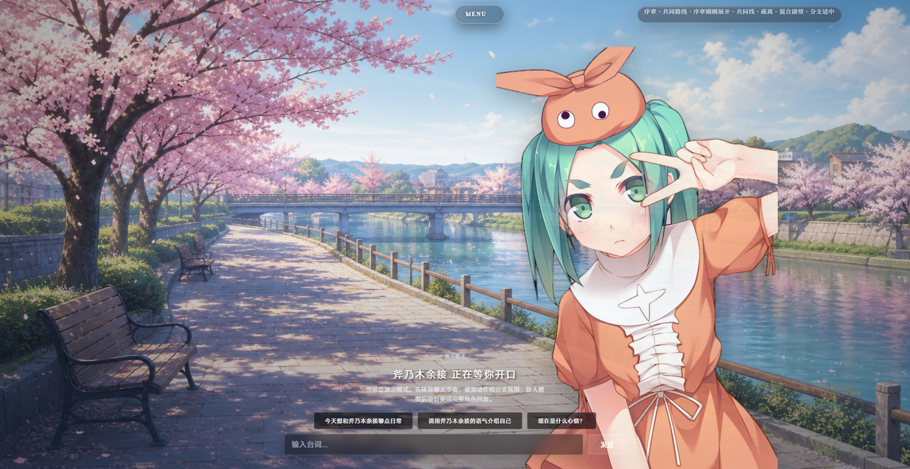
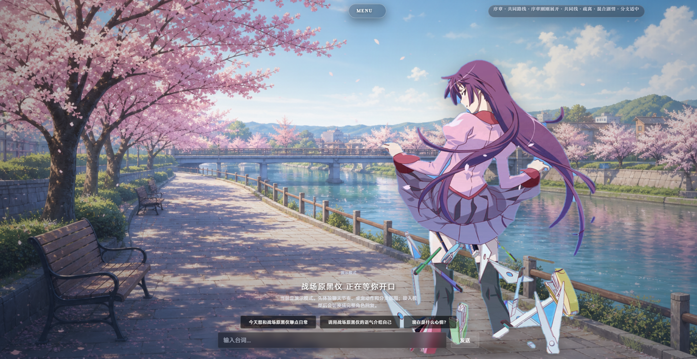
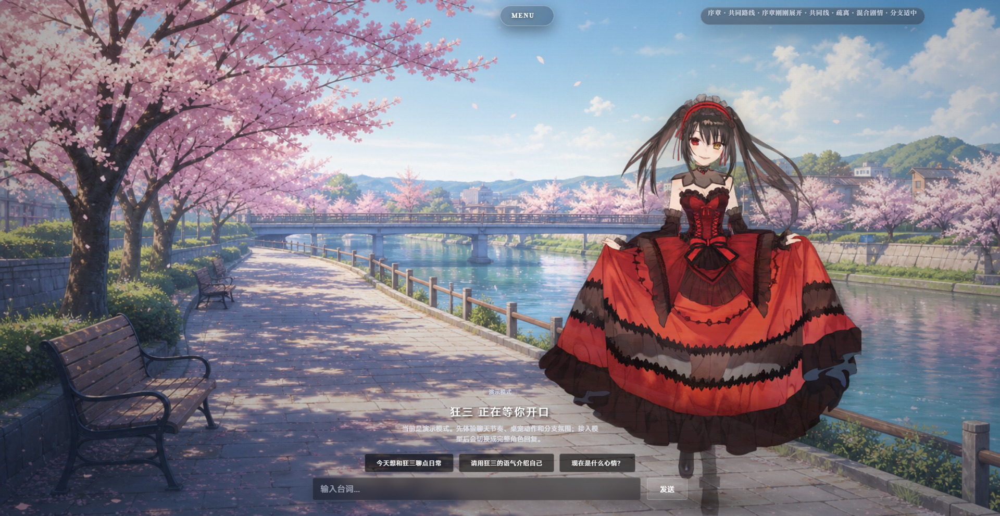
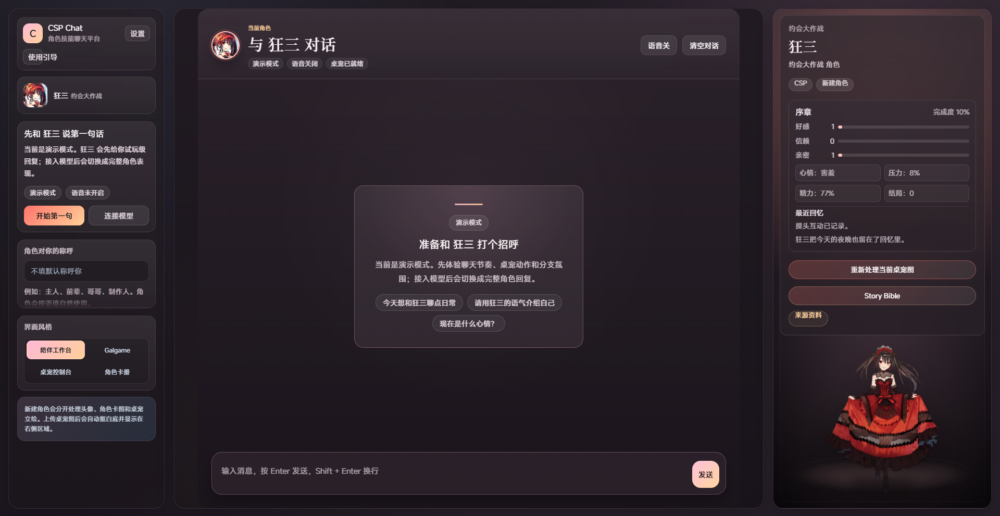
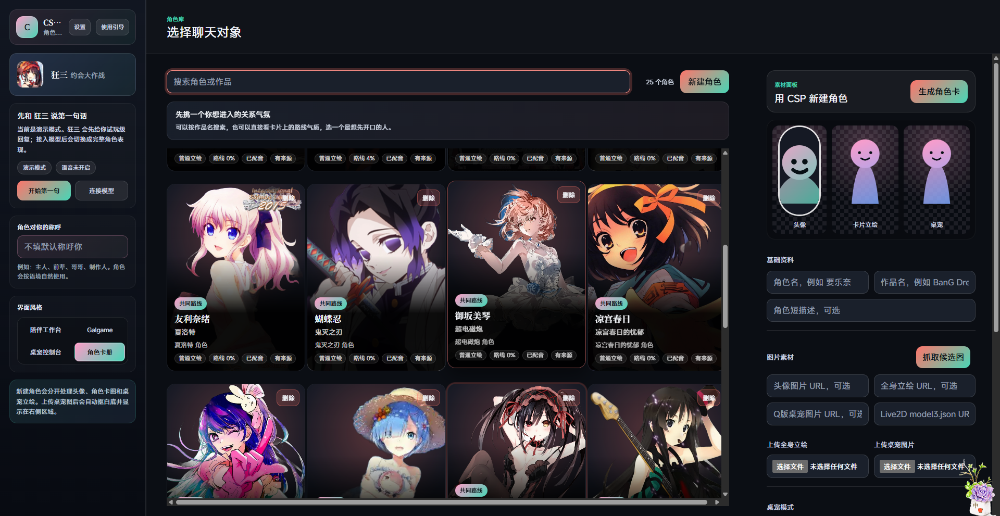
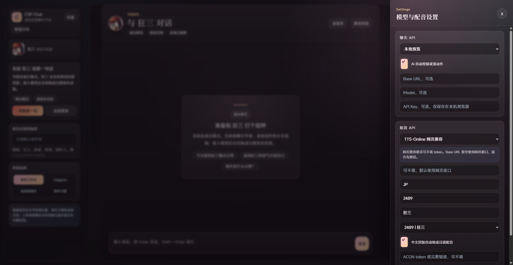

# CSP Visual Chat

CSP Visual Chat 是一个面向二次元角色互动的本地 AI 聊天与 Galgame 原型项目。它以角色 Skill / Story Bible 为核心，把”角色会怎么说、怎么退让、怎么靠近、怎么守住边界”转化为可运行的互动系统，而不只是给聊天窗口换一层视觉小说皮肤。

当前主推方向是 Galgame / Visual Novel：玩家可以自由聊天，也可以进入带路线、关系温度、条件选项和结局态的视觉小说体验。同时支持 ACGN TTS 语音合成，让角色”开口说话”。

## Galgame 方向

本次升级的目标不是做固定台词库，而是让 AI 角色拥有更稳定的”剧情行动逻辑”：

- 叙事结构从单纯聊天升级为 `共同线 -> 个人线 -> 结局态`。
- 关系温度不再只有好感度数字，而是分为 `疏离 / 试探 / 依赖 / 暧昧 / 确定`。
- 选项不再机械弹出，而是根据角色最新回复、当前场景、记忆和路线状态生成。
- 条件选项参考 Ren'Py 的条件菜单思路，只有在前置选择、关系阶段或剧情旗标满足时才出现。
- 每个主推角色都可以拥有专属 Story Bible，用来约束正史窗口、说话方式、亲密节奏、禁止行为、个人线冲突和结局条件。
- 剧情推进必须服从人设和世界观，避免为了恋爱进度让角色突然 OOC 或无视作品设定。
- 路线选项现已支持基于角色回复关键短语的聚焦式选项生成（focus-based choices），替代泛化 fallback，提高选项与对话上下文的关联度。

## 语音合成（ACGN TTS）

项目已集成 ACGN TTS 多路语音合成：

- 默认使用 TTSON API，自动 fallback 到备用节点。
- 支持日语（JP）和中文（zh-CN）声线。
- 角色创建时可自动匹配合适声线，也可手动选择。
- 聊天消息发送后自动合成语音并播放。
- 支持自动翻译模式，将中文文本先翻译再合成日语语音。

## 三种玩法模式

项目目前按三种模式组织 Galgame 体验，让玩家自行选择节奏：

- `自由聊天`：以自然对话为主，适合陪伴、日常互动和角色测试。
- `剧情模式`：系统更主动地推进路线事件，适合体验完整 Galgame 段落。
- `混合模式`：默认推荐模式。平时自由聊天，关键节点进入视觉小说式选择。

## 剧情与人设系统

角色不再共用一套泛化剧情骨架，而是引入半专属路线生成逻辑：

- `温柔型`：核心冲突更偏照顾、消耗、边界和自我压抑。
- `傲娇型`：核心冲突更偏防御、试探、嘴硬和关系确认困难。
- `神秘型`：核心冲突更偏信息差、隐藏身份、信任验证和不可说之事。
- `行动型`：核心冲突更偏责任、目标、保护欲和临场决断。
- `默认型`：提供保守但稳定的通用路线框架，避免无资料角色直接失控。

Story Bible 会作为剧情守门层参与提示词：它不是展示给玩家看的设定表，而是给 AI 使用的“角色叙事契约”。当玩家选项、场景推进或情绪升温超出角色合理边界时，系统应优先选择更小、更可信的回应，而不是强行大改剧情。

## 界面与交互

Galgame 界面正在向全屏视觉小说舞台靠拢：

- 全屏背景、角色立绘、玻璃质感对话框和居中分支选项。
- 菜单改为点击触发，减少 hover 闪烁和堆叠重叠。
- 对话框减少“框外套框”，用半透明、微光影、留白和层级来提升质感。
- 选项卡使用轻量透明卡片，尽量不遮挡背景和立绘。
- 工作台字体、菜单密度、下拉布局和按钮可见性正在按 Galgame 使用场景持续优化。

## 用到的 Skill / 方法

本项目当前用到的能力包括：

- `galgame-story`：用于路线结构、共同线/个人线/结局态、条件选项、关系阶段、Story Bible 和 OOC 守门。
- `csp` / `character-skill-producer`：用于角色资料检索、行为蒸馏、说话 DNA、人设边界和世界观约束。
- `ui-ux-pro-max`：用于 UI 层级、字体可读性、菜单布局、玻璃质感、按钮状态和 Galgame 交互体验优化。
- 项目内自研 Galgame 路线系统：负责玩法模式、路线状态、记忆、旗标、场景上下文分析和选项生成。
- 项目内 Story Bible 生成层：负责把角色模板转成正史窗口、亲密节奏、禁止行为、个人线冲突和结局条件。

## 文档

- [Galgame 产品方向](./docs/galgame/README.md)
- [更新日志](./CHANGELOG.md)
- [UI 结构](./docs/galgame/ui-structure.md)
- [玩法模式](./docs/galgame/gameplay-modes.md)
- [Story Bible](./docs/galgame/story-bible.md)
- [路线状态规格](./docs/galgame/route-state-spec.md)
- [角色 Bible 模板](./docs/galgame/character-bible-template.md)
- [OOC 守门规则](./docs/galgame/ooc-guardrails.md)

## 运行截图

| | | |
|---|---|---|
|  |  |  |
| *Galgame 视觉小说舞台* | *聚焦式路线选项* | *角色对话界面* |
|  |  |  |
| *工作台主界面* | *角色卡册管理* | *ACGN TTS 配音设置* |

以上截图基于 2026-06 版本实机运行画面。

## 技术栈

- Runtime: Node.js 20+
- Backend: Node.js 原生 `http` 服务
- Frontend: 原生 HTML / CSS / JavaScript
- Data: 本地 JSON 文件
- Image processing: Python, Pillow, rembg, OpenCV
- Live2D runtime: Live2D Cubism Core, PixiJS, pixi-live2d-display

项目没有引入前端构建链路，启动后由 Node 服务直接提供静态页面与 API。

## 一键部署

Windows PowerShell:

```powershell
git clone https://github.com/lgcr12/csp-visual-chat.git
cd csp-visual-chat
powershell -ExecutionPolicy Bypass -File .\deploy.ps1
```

或直接双击运行：

```powershell
.\deploy.bat
```

指定端口：

```powershell
powershell -ExecutionPolicy Bypass -File .\deploy.ps1 -Port 4175
```

跳过 Python 抠图依赖安装：

```powershell
powershell -ExecutionPolicy Bypass -File .\deploy.ps1 -SkipPython
```

启动成功后访问：

```text
http://localhost:4173
```

如果指定了端口，请访问对应端口，例�
