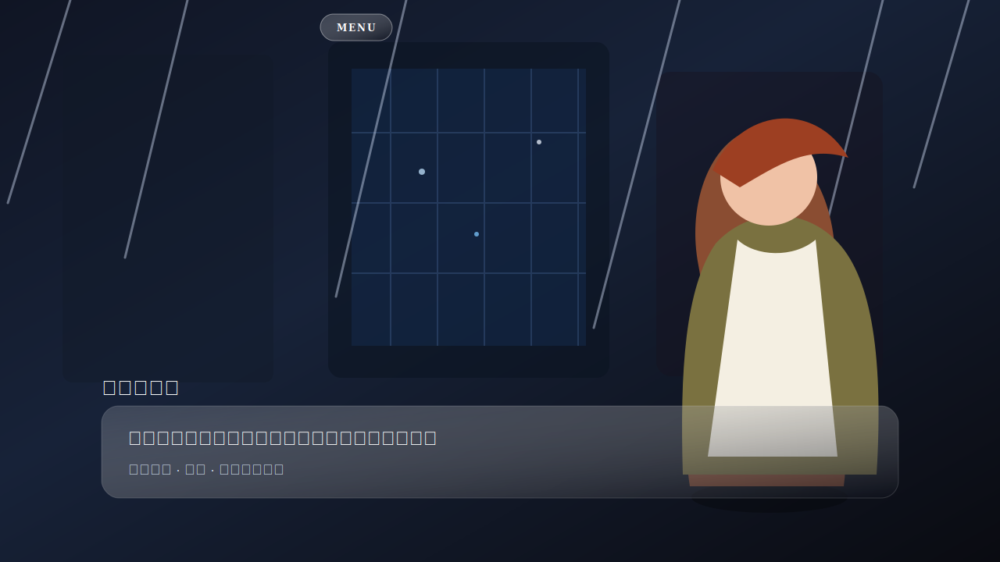
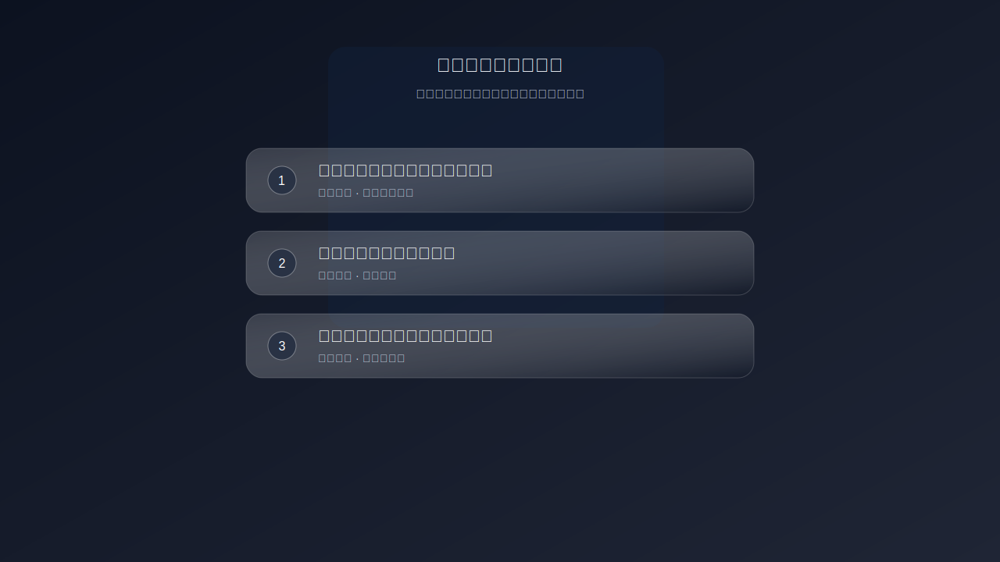
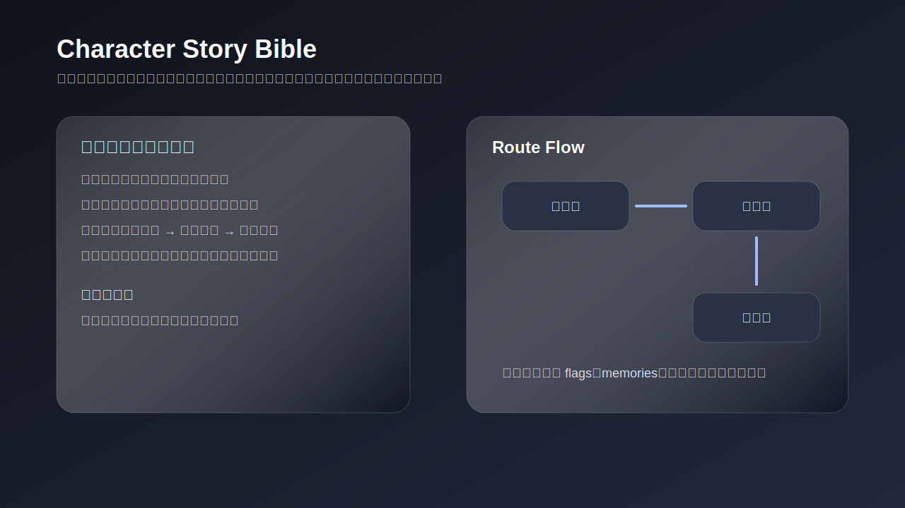

# Galgame Direction

This folder defines the product direction for making CSP Visual Chat a real AI galgame experience, not just a chat UI skin.

The core principle is simple: every route event, choice, and relationship change must remain believable for the character and the original world.

## Documents

- [UI structure](./ui-structure.md): stage layout, dialogue hierarchy, system menu placement, and mobile behavior.
- [Gameplay modes](./gameplay-modes.md): free chat, story mode, and hybrid mode.
- [Story bible](./story-bible.md): common route, personal route, ending states, and narrative units.
- [Route state spec](./route-state-spec.md): state fields, relationship stages, choice conditions, memories, and endings.
- [Character bible template](./character-bible-template.md): per-character constraints for speech, intimacy, stress response, and world knowledge.
- [OOC guardrails](./ooc-guardrails.md): checks that prevent plot convenience from breaking character or world logic.
- [Implementation plan](./implementation-plan.md): staged delivery plan for code work.

## Product Definition

CSP Visual Chat should become a playable AI galgame:

- The player can freely talk to a character.
- The system can also guide route events with visual novel style choices.
- The relationship can move from distance to trust, dependence, ambiguity, and confirmation.
- The story can reach a readable ending state.
- The character must not act outside their established behavior, knowledge, or world constraints.

## Reference Approach

Use three layers together:

- `galgame-story` for route structure, conditional choices, story bible, character bible, and OOC guardrails.
- `ui-ux-pro-max` for interface hierarchy, readability, touch targets, and visual polish.
- `csp` for character behavior, speech DNA, relationship boundaries, and world knowledge limits.
- A project-native route state system for modes, choices, memories, and endings.

## Default Direction

The default experience should be `hybrid mode`:

- Free chat is available most of the time.
- Story events appear when route state and memories justify them.
- Key moments switch into visual novel style choices.
- After a route event resolves, the player returns to normal interaction.

## Current Implementation Snapshot

The current implementation focuses on a playable visual novel layer:

- A full-screen Galgame stage with character standee, atmospheric backgrounds, rain/petal effects, glass dialogue, and click-only menu.
- Contextual route choices generated from the assistant's latest reply content.
- Route state with phase, relationship stage, tension, honesty, flags, memories, current scene, and ending state.
- Character-specific Story Bible drafts generated from route templates.
- Semi-specialized route events for warm, tsundere, mystery, brave, and default character types.

## Screenshots

## Latest Changelog

See [../../CHANGELOG.md](../../CHANGELOG.md) for the full update log.
